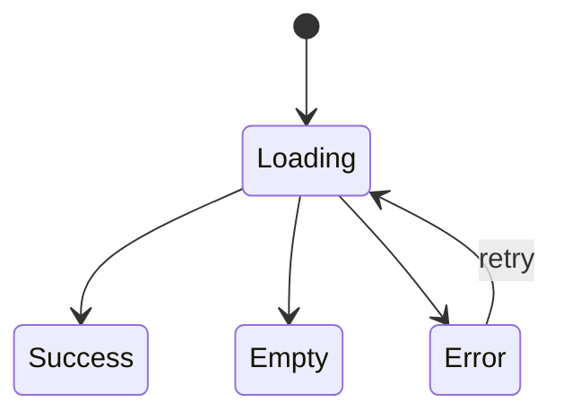

# SPEC.md — Spec Driven Development para Features Mobile Flutter

> Este arquivo é a **fonte de verdade técnica e funcional** para desenvolvimento ou modificação de uma feature.
> Ele deve ser preenchido antes da implementação e usado pelo agente de IA como contrato de execução.
>
> Diferente de um arquivo de rules/guardrails, este documento descreve **o que deve ser construído**, **por que**, **como validar** e **quais critérios definem sucesso**.

---

## 1. Identificação da Spec

| Campo | Valor |
|---|---|
| Nome da feature | `<nome-da-feature>` |
| Tipo de demanda | `Nova feature / Evolução / Correção funcional / Refatoração orientada a produto` |
| App / Produto | `<nome-do-app>` |
| Plataforma | `Flutter / Android / iOS / Web` |
| Responsável técnico | `<nome>` |
| Responsável de produto | `<nome>` |
| Status da spec | `Draft / Em revisão / Aprovada / Em implementação / Validada / Encerrada` |
| Branch sugerida | `feature/<nome-curto-da-feature>` |
| Ticket/PBI/Issue | `<link-ou-id>` |
| Data de criação | `<yyyy-mm-dd>` |
| Última atualização | `<yyyy-mm-dd>` |

---

## 2. Objetivo

Descrever de forma objetiva o que esta feature precisa entregar.

### Objetivo principal

`<Explique em 2 a 5 linhas o resultado esperado para o usuário, negócio ou operação.>`

### Resultado esperado

Ao final da implementação, o sistema deverá permitir que:

- `<resultado esperado 1>`;
- `<resultado esperado 2>`;
- `<resultado esperado 3>`.

---

## 3. Problema que está sendo resolvido

Descrever o problema atual, limitação, oportunidade ou necessidade de negócio.

### Contexto atual

`<Explique como o sistema funciona hoje e qual é a dor.>`

### Problema

`<Explique o problema de forma clara, sem entrar ainda na solução técnica.>`

### Impacto do problema

| Dimensão | Impacto |
|---|---|
| Usuário final | `<impacto>` |
| Negócio | `<impacto>` |
| Operação / suporte | `<impacto>` |
| Engenharia | `<impacto>` |
| Segurança / compliance | `<impacto, se houver>` |

---

## 4. Escopo

### Dentro do escopo

A implementação deve contemplar:

- `<item dentro do escopo 1>`;
- `<item dentro do escopo 2>`;
- `<item dentro do escopo 3>`.

### Fora do escopo

A implementação **não** deve contemplar:

- `<item fora do escopo 1>`;
- `<item fora do escopo 2>`;
- `<item fora do escopo 3>`.

### Premissas

- `<premissa 1>`;
- `<premissa 2>`;
- `<premissa 3>`.

### Dependências

| Dependência | Tipo | Responsável | Status |
|---|---|---|---|
| `<ex: API de perfil>` | `Backend / Design / Produto / Segurança / Analytics` | `<nome/time>` | `Pendente / Pronto / Bloqueado` |

---

## 5. Personas e jornadas

### Personas impactadas

| Persona | Descrição | Necessidade |
|---|---|---|
| `<persona>` | `<descrição>` | `<necessidade>` |

### Jornada atual

1. `<passo atual 1>`;
2. `<passo atual 2>`;
3. `<passo atual 3>`.

### Jornada proposta

1. `<passo proposto 1>`;
2. `<passo proposto 2>`;
3. `<passo proposto 3>`.

---

## 6. Requisitos funcionais

> Use IDs estáveis. O agente deve referenciar esses IDs ao implementar e ao gerar relatório técnico.

| ID | Requisito | Prioridade | Observações |
|---|---|---|---|
| RF-001 | `<descrição do requisito funcional>` | `Must / Should / Could` | `<observações>` |
| RF-002 | `<descrição do requisito funcional>` | `Must / Should / Could` | `<observações>` |
| RF-003 | `<descrição do requisito funcional>` | `Must / Should / Could` | `<observações>` |

### Regras de negócio

| ID | Regra | Exemplo |
|---|---|---|
| RN-001 | `<descrição da regra>` | `<exemplo prático>` |
| RN-002 | `<descrição da regra>` | `<exemplo prático>` |

### Casos alternativos

| ID | Cenário | Comportamento esperado |
|---|---|---|
| CA-001 | `<cenário alternativo>` | `<comportamento>` |
| CA-002 | `<cenário alternativo>` | `<comportamento>` |

### Casos de erro

| ID | Erro | Mensagem/Tratamento esperado |
|---|---|---|
| ER-001 | `<erro esperado>` | `<tratamento>` |
| ER-002 | `<erro esperado>` | `<tratamento>` |

---

## 7. Requisitos não funcionais

| ID | Categoria | Requisito | Critério objetivo |
|---|---|---|---|
| RNF-001 | Performance | `<requisito>` | `<ex: tela carrega em até X segundos>` |
| RNF-002 | Segurança | `<requisito>` | `<ex: não persistir dado sensível em texto puro>` |
| RNF-003 | Acessibilidade | `<requisito>` | `<ex: labels semânticos nos componentes interativos>` |
| RNF-004 | Observabilidade | `<requisito>` | `<ex: evento analytics registrado no fluxo principal>` |
| RNF-005 | Compatibilidade | `<requisito>` | `<ex: Android minSdk X / iOS mínimo Y>` |
| RNF-006 | Manutenibilidade | `<requisito>` | `<ex: manter padrão de arquitetura do módulo>` |

---

## 8. UX, UI e conteúdo

### Referências de design

| Item | Link / descrição |
|---|---|
| Figma | `<link>` |
| Protótipo | `<link>` |
| Design system | `<link ou descrição>` |
| Componentes existentes | `<componentes reutilizáveis>` |

### Telas impactadas

| Tela | Tipo de alteração | Observações |
|---|---|---|
| `<nome-da-tela>` | `Nova / Alterada / Removida` | `<observações>` |

### Estados de tela

A implementação deve prever os seguintes estados:

- `Loading`;
- `Success`;
- `Empty`;
- `Error`;
- `Offline`, se aplicável;
- `Unauthorized`, se aplicável;
- `Partial content`, se aplicável.

### Textos e mensagens

| Contexto | Texto esperado |
|---|---|
| Título | `<texto>` |
| Descrição | `<texto>` |
| CTA primário | `<texto>` |
| CTA secundário | `<texto>` |
| Erro genérico | `<texto>` |
| Estado vazio | `<texto>` |

---

## 9. Arquitetura técnica proposta

### Módulo ou camada impactada

Descrever onde a feature deve ser implementada.

Exemplo:

```text
lib/
├── features/
│   └── <feature_name>/
│       ├── data/
│       ├── domain/
│       ├── presentation/
│       └── navigation/
```

### Padrão arquitetural esperado

Informar o padrão usado pelo projeto.

- `Clean Architecture`;
- `MVVM`;
- `MVP`;
- `BLoC`;
- `Cubit`;
- `Provider`;
- `Riverpod`;
- `GetX`;
- `Outro: <descrever>`.

### Decisão arquitetural

`<Explique a decisão técnica principal e por que ela faz sentido para esta feature.>`

### Componentes técnicos previstos

| Componente | Responsabilidade |
|---|---|
| `<View/Page/Screen>` | `<responsabilidade>` |
| `<ViewModel/Bloc/Cubit/Controller>` | `<responsabilidade>` |
| `<UseCase>` | `<responsabilidade>` |
| `<Repository>` | `<responsabilidade>` |
| `<DataSource>` | `<responsabilidade>` |
| `<Model/DTO/Entity>` | `<responsabilidade>` |
| `<Mapper>` | `<responsabilidade>` |

---

## 10. Contratos de dados e integrações

### APIs consumidas

| API | Método | Endpoint | Autenticação | Observações |
|---|---|---|---|---|
| `<nome>` | `GET/POST/PUT/PATCH/DELETE` | `<endpoint>` | `<tipo>` | `<observações>` |

### Request

```json
{
  "field": "value"
}
```

### Response de sucesso

```json
{
  "field": "value"
}
```

### Response de erro

```json
{
  "error": {
    "code": "ERROR_CODE",
    "message": "Mensagem de erro"
  }
}
```

### Mapeamento de dados

| Origem | Destino | Regra de transformação |
|---|---|---|
| `<campo_api>` | `<campo_modelo>` | `<regra>` |

### Persistência local

| Dado | Local | Criptografado? | TTL / expiração | Observações |
|---|---|---|---|---|
| `<dado>` | `SharedPreferences / SecureStorage / SQLite / Hive / Outro` | `Sim / Não` | `<tempo>` | `<observações>` |

---

## 11. Navegação e estado

### Entrada na feature

A feature poderá ser acessada por:

- `<menu>`;
- `<deeplink>`;
- `<push notification>`;
- `<banner>`;
- `<fluxo interno>`;
- `<outro>`.

### Rotas

| Rota | Parâmetros | Origem |
|---|---|---|
| `<route_name>` | `<params>` | `<origem>` |

### Estados de domínio

| Estado | Descrição |
|---|---|
| `<estado>` | `<descrição>` |

### Transições esperadas



---

## 12. Analytics, logs e observabilidade

### Eventos de analytics

| Evento | Quando disparar | Parâmetros |
|---|---|---|
| `<event_name>` | `<momento>` | `<params>` |

### Logs técnicos

| Log | Nível | Dados permitidos |
|---|---|---|
| `<log>` | `debug/info/warn/error` | `<sem dados sensíveis>` |

### Métricas de sucesso

| Métrica | Como medir | Meta |
|---|---|---|
| `<métrica>` | `<origem>` | `<meta>` |

### Crash/Error reporting

A implementação deve registrar erros relevantes em ferramenta de observabilidade, sem incluir:

- tokens;
- CPF;
- e-mail completo;
- dados sensíveis;
- payloads completos de APIs;
- secrets;
- headers de autenticação.

---

## 13. Feature flags e rollout

### Feature flag

| Campo | Valor |
|---|---|
| Nome da flag | `<feature_flag_name>` |
| Valor padrão | `false` |
| Fonte | `Firebase Remote Config / Backend / Local / Outro` |
| Estratégia de fallback | `<fallback>` |

### Rollout proposto

| Fase | Público | Critério para avançar |
|---|---|---|
| Fase 1 | Interno / QA | `<critério>` |
| Fase 2 | Beta / grupo controlado | `<critério>` |
| Fase 3 | Percentual inicial | `<critério>` |
| Fase 4 | 100% | `<critério>` |

### Plano de rollback

`<Descrever como desabilitar ou reverter a feature em caso de falha.>`

---

## 14. Impacto técnico

### Arquivos ou áreas provavelmente impactadas

| Área | Tipo de impacto | Observações |
|---|---|---|
| `lib/features/<feature>` | `Novo / Alterado` | `<observações>` |
| `test/` | `Novo / Alterado` | `<observações>` |
| `pubspec.yaml` | `Alterado / Não alterado` | `<observações>` |
| `android/` | `Alterado / Não alterado` | `<observações>` |
| `ios/` | `Alterado / Não alterado` | `<observações>` |
| CI/CD | `Alterado / Não alterado` | `<observações>` |

### Riscos técnicos

| Risco | Probabilidade | Impacto | Mitigação |
|---|---|---|---|
| `<risco>` | `Baixa / Média / Alta` | `Baixo / Médio / Alto` | `<mitigação>` |

### Dívidas técnicas relacionadas

| Dívida | Decisão |
|---|---|
| `<dívida>` | `Resolver agora / Criar tarefa futura / Ignorar justificadamente` |

---

## 15. Plano de implementação

> Esta seção orienta a execução incremental. O agente deve seguir esta ordem, salvo justificativa técnica registrada no relatório.

### Etapa 1 — Análise

- [ ] Ler esta spec integralmente.
- [ ] Identificar módulos impactados.
- [ ] Verificar padrões já existentes no projeto.
- [ ] Confirmar dependências.
- [ ] Gerar plano técnico antes de alterar código.

### Etapa 2 — Estrutura

- [ ] Criar estrutura de diretórios necessária.
- [ ] Criar entidades/modelos.
- [ ] Criar contratos de repository/datasource.
- [ ] Criar camada de domínio, se aplicável.
- [ ] Criar camada de apresentação, se aplicável.

### Etapa 3 — Implementação funcional

- [ ] Implementar regras `RF-*`.
- [ ] Implementar regras de negócio `RN-*`.
- [ ] Implementar tratamento de erros `ER-*`.
- [ ] Implementar estados de tela.
- [ ] Implementar navegação.
- [ ] Implementar analytics/logs previstos.

### Etapa 4 — Testes

- [ ] Criar ou atualizar testes unitários.
- [ ] Criar ou atualizar testes de widget.
- [ ] Criar ou atualizar testes de integração, se aplicável.
- [ ] Validar mocks/stubs.
- [ ] Cobrir cenários principais, alternativos e de erro.

### Etapa 5 — Validação local

Executar, quando aplicável:

```bash
flutter analyze
dart format --set-exit-if-changed .
flutter test
```

Adicionar comandos específicos do projeto:

```bash
<command>
```

### Etapa 6 — Preparação de PR

- [ ] Gerar resumo técnico da implementação.
- [ ] Relacionar requisitos atendidos.
- [ ] Informar testes executados.
- [ ] Informar riscos e limitações.
- [ ] Solicitar revisão dos CODEOWNERS.
- [ ] Não realizar merge automático.

---

## 16. Estratégia de testes

### Testes unitários

| ID | Cenário | Dado | Quando | Então |
|---|---|---|---|---|
| TU-001 | `<cenário>` | `<dado>` | `<ação>` | `<resultado>` |

### Testes de widget

| ID | Tela/Componente | Cenário | Resultado esperado |
|---|---|---|---|
| TW-001 | `<componente>` | `<cenário>` | `<resultado>` |

### Testes de integração

| ID | Fluxo | Resultado esperado |
|---|---|---|
| TI-001 | `<fluxo>` | `<resultado>` |

### Testes manuais de QA

| ID | Cenário | Passos | Resultado esperado |
|---|---|---|---|
| QA-001 | `<cenário>` | `<passos>` | `<resultado>` |

### Cenários mínimos obrigatórios

- [ ] Fluxo feliz.
- [ ] Estado de loading.
- [ ] Estado vazio.
- [ ] Erro de API.
- [ ] Erro de conexão.
- [ ] Retry.
- [ ] Navegação de entrada.
- [ ] Navegação de saída.
- [ ] Feature flag desligada, se aplicável.
- [ ] Feature flag ligada, se aplicável.

---

## 17. Critérios de aceite

> A feature só pode ser considerada pronta se todos os critérios `CA-*` estiverem atendidos.

| ID | Critério | Evidência esperada |
|---|---|---|
| CA-001 | `<critério objetivo>` | `<teste, print, log, evidência de PR ou CI>` |
| CA-002 | `<critério objetivo>` | `<teste, print, log, evidência de PR ou CI>` |
| CA-003 | `<critério objetivo>` | `<teste, print, log, evidência de PR ou CI>` |

---

## 18. Definition of Ready

A implementação só deve começar quando:

- [ ] Objetivo da feature estiver claro.
- [ ] Escopo e fora de escopo estiverem definidos.
- [ ] Requisitos funcionais estiverem descritos.
- [ ] Critérios de aceite estiverem definidos.
- [ ] Dependências externas estiverem mapeadas.
- [ ] Contratos de API estiverem disponíveis ou mockados.
- [ ] Design ou comportamento esperado estiver documentado.
- [ ] Estratégia de teste estiver definida.
- [ ] Riscos principais estiverem mapeados.

---

## 19. Definition of Done

A feature só deve ser considerada concluída quando:

- [ ] Todos os requisitos `RF-*` obrigatórios forem implementados.
- [ ] Todas as regras `RN-*` forem respeitadas.
- [ ] Todos os critérios `CA-*` forem atendidos.
- [ ] Testes automatizados relevantes forem criados ou atualizados.
- [ ] `flutter analyze` estiver sem erro.
- [ ] `flutter test` estiver aprovado.
- [ ] A documentação necessária estiver atualizada.
- [ ] O PR estiver aberto com descrição técnica.
- [ ] O CI estiver aprovado.
- [ ] A revisão humana obrigatória tiver sido solicitada.

---

## 20. Orientação de uso pelo agente de IA

> Esta seção não substitui rules/guardrails globais do agente. Ela apenas define como o agente deve usar **esta spec** durante o ciclo SDD.

### Antes de implementar

O agente deve:

1. Ler esta spec por completo.
2. Identificar lacunas, ambiguidades ou conflitos.
3. Gerar um plano de implementação baseado nas seções `6`, `9`, `10`, `15`, `16` e `17`.
4. Não alterar código se os critérios mínimos da `Definition of Ready` não estiverem claros.
5. Quando houver lacuna, registrar a pendência no relatório técnico.

### Durante a implementação

O agente deve:

1. Implementar somente o que estiver descrito nesta spec.
2. Referenciar IDs de requisitos nos commits e no relatório.
3. Manter mudanças pequenas, rastreáveis e coerentes com a arquitetura do projeto.
4. Atualizar testes junto com a implementação.
5. Evitar refatorações fora do escopo.

### Após a implementação

O agente deve gerar um relatório contendo:

```markdown
# Relatório de Implementação

## Spec
- Feature:
- Ticket/PBI:
- Branch:

## Requisitos atendidos
- RF-001:
- RF-002:

## Arquivos alterados
- caminho/do/arquivo.dart — motivo da alteração

## Testes executados
- Comando:
- Resultado:

## Critérios de aceite
- CA-001: Atendido / Não atendido
- CA-002: Atendido / Não atendido

## Riscos remanescentes
- risco:

## Pendências
- pendência:

## Recomendação
- Pronto para revisão humana: Sim / Não
```

---

## 21. Template de PR

```markdown
## Objetivo

Implementa a spec `<nome-da-feature>`.

## Referências

- Spec: `SPEC.md`
- Ticket/PBI: `<link>`

## Requisitos implementados

- [ ] RF-001
- [ ] RF-002
- [ ] RF-003

## Critérios de aceite

- [ ] CA-001
- [ ] CA-002
- [ ] CA-003

## Testes executados

- [ ] `flutter analyze`
- [ ] `dart format --set-exit-if-changed .`
- [ ] `flutter test`
- [ ] Outros: `<informar>`

## Evidências

- `<prints, logs, vídeo, output do CI ou descrição>`

## Riscos e observações

- `<informar riscos, limitações ou decisões técnicas>`

## Checklist

- [ ] Não contém secrets.
- [ ] Não altera produção diretamente.
- [ ] Não altera regras de branch protection.
- [ ] Não ignora falhas de CI.
- [ ] Solicita revisão dos CODEOWNERS.
```

---

## 22. Histórico de decisões

| Data | Decisão | Motivo | Responsável |
|---|---|---|---|
| `<yyyy-mm-dd>` | `<decisão>` | `<motivo>` | `<nome>` |

---

## 23. Pendências abertas

| ID | Pendência | Responsável | Bloqueia implementação? |
|---|---|---|---|
| P-001 | `<pendência>` | `<responsável>` | `Sim / Não` |
